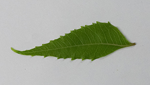
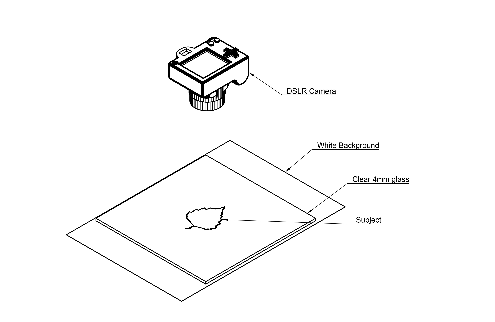

# project-leafy

## Building largest Bio Image dataset.

### Currently available data

*Azadirachta indica*  කොහොඹ (SI), வேம்பு (TA), Neem(EN) - 2362x748 500 JPEG Images. [Click here](https://1drv.ms/u/s!Asqa_dm6rYv1bxZu9Tu4Hmm1iLs?e=X7M5hQ)

### Image capture method 

I'm using a DSLR (Nikon D3400 With 55mm Lens) to capture the images for the leaves. The camera is placed at adequate 
height and focus the object properly with the lens. For lightning i use two led lights and two diffusers. To get good 
level of details I used a clear 200x200x4mm clear class plate.

Made with ❤️ in Sri Lanka.
